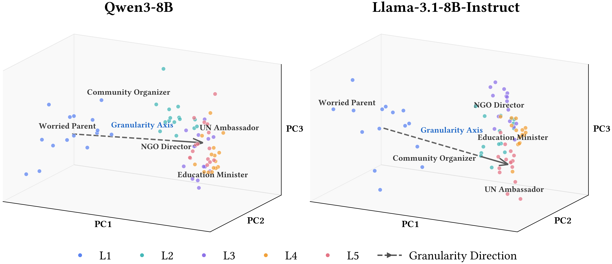

<p align="center">
<h1 align="center">The Granularity Axis: A Micro-to-Macro Latent Direction for Social Roles in Language Models</h1>
</p>

<!-- <p align="center">
    <a href="https://arxiv.org/abs/2604.08064"></a>
    <a href="https://github.com/qinchonghanzuibang/ImplicitMemBench/blob/main/LICENSE"></a>
    <a href="https://github.com/qinchonghanzuibang/ImplicitMemBench/blob/main/dataset/LICENSE"></a>
</p> -->

<p align="center">
<strong>Chonghan Qin</strong><sup>1</sup>, 
<strong>Xiachong Feng</strong><sup>1*</sup>, 
<strong>Ziyun Song</strong><sup>2</sup>, 
<strong>Xiaocheng Feng</strong><sup>2</sup>,
<strong>Jing Xiong</strong><sup>1</sup>,
<strong>Lingpeng Kong</strong><sup>1</sup>
</p>

<p align="center">
<sup>1</sup>The University of Hong Kong &nbsp;&nbsp;
<sup>2</sup>Harbin Institute of Technology
</p>

<p align="center">
<sup>*</sup>Corresponding Author
</p>


Granularity studies whether LLMs internally encode the **social scale** of prompted roles—ranging from **micro** (individual experience) to **macro** (organizational/institutional/national reasoning). We compute a **contrast-defined activation-space direction** (the Granularity Axis) from role-conditioned hidden-state representations, and evaluate it via (1) representation geometry (PCA alignment + monotonic projections) and (2) **activation steering**.

This repository includes:

- code to run the **end-to-end pipeline** (response generation → activations → vectors → axis)
- scripts for **representation analyses**, **steering sweeps**, and **judge-based evaluation**
- the role set (75 roles, 5 levels) in `data/entities.json` (+ metadata and prompts)

<p align="center">
    
</p>

<p align="left">
  <strong>Role representation space.</strong> Role-level hidden-state representations organize along a micro-to-macro structure. Colors indicate granularity level (L1–L5), and the dashed arrow denotes the contrast-defined Granularity Axis from micro-level to macro-level roles.
</p>

## Installation

Create the conda environment and install Python dependencies:

```bash
conda create -n granularity python=3.10 -y
conda activate granularity
pip install -r requirements.txt
```

If you are running the provided one-click scripts, make sure you run all commands from the repository root.

## Repository Structure

- `pipeline/`: end-to-end scripts for running the pipeline and analyses
- `lib/`: core utilities (generation, steering, PCA, judge helpers)
- `data/`: role set + questions + steering prompts + judge rubric
## Quick Start

The pipeline is provided as **two one-click scripts** (Qwen and Llama). The defaults are set to match the **main paper settings**:

- Main pipeline: roles → responses → activations → vectors → axis
- Analyses: representation suite + subgroup analysis
- Steering (paper default): greedy decoding at layer 18 with \(\alpha \in \{-4, 0, +4\}\)
- Prompt sets: **generic** prompts (40) + **micro-targeted** prompts (12)
- Evaluation: text metrics + optional judge scoring (set `OPENAI_API_KEY`)

```bash
bash pipeline/run_qwen_full.sh
bash pipeline/run_llama_full.sh
```

### Optional: enable extra analyses (appendix-style)

Both scripts support opt-in toggles via environment variables:

```bash
# Run score-filtering ablation
RUN_SCORE_FILTERING=1 bash pipeline/run_qwen_full.sh

# Run steering robustness bundle (truncation + summaries)
RUN_STEERING_ROBUSTNESS=1 bash pipeline/run_qwen_full.sh

# Run decoding sensitivity (sampled decoding)
RUN_DECODING_SENSITIVITY=1 bash pipeline/run_qwen_full.sh
```

## Outputs

By default, outputs go under:

- `outputs/<model_slug>/responses/`
- `outputs/<model_slug>/activations/`
- `outputs/<model_slug>/vectors/`
- `outputs/<model_slug>/axis/`
- `outputs/<model_slug>/steering/`
- `outputs/<model_slug>/analysis/`

## Notes

- The one-click scripts assume you have `vLLM` working for generation and enough GPU memory for your chosen model.
- Judge-based evaluation requires an OpenAI-compatible endpoint. Set `OPENAI_API_KEY` (and optionally `OPENAI_BASE_URL`).
- This repo intentionally does **not** include large generated artifacts (e.g., activations / responses). You should generate them locally.

## License

- **Code**: MIT License
- **Data**: CC BY 4.0

## Citation

If you use Granularity in your research, please cite:

```bibtex
@misc{qin2026granularityaxismicrotomacrolatent,
      title={The Granularity Axis: A Micro-to-Macro Latent Direction for Social Roles in Language Models}, 
      author={Chonghan Qin and Xiachong Feng and Ziyun Song and Xiaocheng Feng and Jing Xiong and Lingpeng Kong},
      year={2026},
      eprint={2605.06196},
      archivePrefix={arXiv},
      primaryClass={cs.AI},
      url={https://arxiv.org/abs/2605.06196}, 
}
```